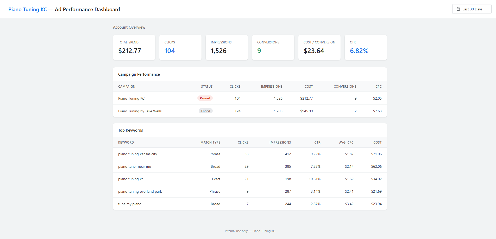

# Google Ads API — Design Document
## Piano Tuning KC — Basic Access Application

---

### Company Name
Piano Tuning KC

### Company Website
https://pianotuningkc.com

### Google Ads Customer ID
790-110-2348

---

### Business Model

Piano Tuning KC is a local piano tuning service operating in the Kansas City metropolitan area. We operate a single website (https://pianotuningkc.com) which serves as our primary online presence for booking piano tuning appointments. We only advertise for our own business and do not manage ads for any other companies or clients.

---

### Tool Access / Use

Our tool is an **internal-only reporting and automation system** used exclusively by the business owner and a technical consultant to:

1. **View and analyze ad performance** — A lightweight internal dashboard that displays campaign metrics (clicks, impressions, conversions, cost, CPC, CTR) across configurable date ranges. This dashboard is accessible only to authorized internal users and is not publicly accessible.

2. **Generate performance reports** — The tool can export ad performance summaries for internal review. These reports are used solely for internal business decisions (budget allocation, keyword optimization, seasonal planning). Reports are not shared with any external agencies or third parties.

3. **Automated campaign monitoring** — A scheduled script runs periodically to pull the latest campaign metrics and flag significant changes in performance (e.g., cost-per-conversion exceeding a threshold, conversion rate drops, budget pacing issues). Alerts are sent to the business owner via internal notification.

**No external parties will have access to the tool.** It is hosted locally and used only by internal personnel.

---

### Tool Design

#### Data Flow Architecture

```
Google Ads API (GAQL queries)
        │
        ▼
  Python Script (google-ads library)
        │
        ▼
  Local SQLite Database (metrics cache)
        │
        ▼
  Internal Dashboard (HTML/JS, localhost)
        │
        ▼
  Business Owner views reports
```

#### How It Works

1. **Data Collection**: A Python script using the official `google-ads` Python client library makes read-only API calls using Google Ads Query Language (GAQL) to retrieve campaign, ad group, keyword, and search term performance data.

2. **Data Storage**: Retrieved metrics are stored in a local SQLite database to enable historical trend analysis and reduce redundant API calls. The database is stored locally and is not accessible externally.

3. **Dashboard Display**: A simple internal web dashboard (served on localhost) reads from the local database to display:
   - Account-level summary metrics (spend, clicks, impressions, conversions, CPC, CTR)
   - Campaign-level performance comparison
   - Keyword performance with cost and conversion data
   - Date range filtering (last 7 days, 30 days, 90 days, all time)

4. **Automated Monitoring**: A scheduled script (cron/task scheduler) runs every 4 hours during business hours to:
   - Pull the latest performance metrics
   - Compare against historical baselines
   - Log any significant performance changes

#### Data Retention
- Metrics data is retained locally for up to 12 months for trend analysis
- No personally identifiable information (PII) is collected or stored
- Only aggregate performance metrics are retrieved from the API

---

### API Services Called

We will use **read-only** access to the following API resources:

| API Resource | Purpose | Operations |
|-------------|---------|------------|
| **GoogleAdsService** | Execute GAQL queries to pull performance reports | `Search`, `SearchStream` |
| **Customer** | Retrieve account-level settings and summary metrics | Read only |
| **Campaign** | Pull campaign names, statuses, budgets, and bid strategies | Read only |
| **AdGroup** | View ad group structure and performance | Read only |
| **AdGroupAd** | Review ad copy and ad-level performance metrics | Read only |
| **AdGroupCriterion** (Keywords) | Analyze keyword performance, match types, Quality Score | Read only |
| **SearchTermView** | Review actual search queries that triggered ads | Read only |
| **GeoTargetConstant** | Understand geographic targeting settings | Read only |

**We do NOT modify, create, or delete any campaigns, ads, or keywords via the API.** All campaign management is done through the Google Ads web interface. The API is used exclusively for reporting and analysis.

#### Example GAQL Queries

**Campaign Performance Report:**
```sql
SELECT
  campaign.name,
  campaign.status,
  campaign_budget.amount_micros,
  metrics.impressions,
  metrics.clicks,
  metrics.cost_micros,
  metrics.conversions,
  metrics.average_cpc,
  metrics.ctr
FROM campaign
WHERE segments.date DURING LAST_30_DAYS
ORDER BY metrics.cost_micros DESC
```

**Keyword Performance Report:**
```sql
SELECT
  ad_group_criterion.keyword.text,
  ad_group_criterion.keyword.match_type,
  metrics.impressions,
  metrics.clicks,
  metrics.cost_micros,
  metrics.conversions,
  metrics.average_cpc
FROM keyword_view
WHERE segments.date DURING LAST_30_DAYS
  AND metrics.impressions > 0
ORDER BY metrics.cost_micros DESC
```

**Search Terms Report:**
```sql
SELECT
  search_term_view.search_term,
  metrics.impressions,
  metrics.clicks,
  metrics.cost_micros,
  metrics.conversions
FROM search_term_view
WHERE segments.date DURING LAST_30_DAYS
ORDER BY metrics.impressions DESC
```

---

### Tool Mockup

The dashboard is an internal-only tool served on localhost. Below is a mockup of the reporting interface:



**Dashboard Features:**
- **Account Overview** — Summary cards showing total spend, clicks, impressions, conversions, cost/conversion, and CTR for the selected date range
- **Campaign Performance** — Table comparing all campaigns with status indicators, click/impression/cost/conversion metrics
- **Top Keywords** — Table showing keyword-level performance including match type, CTR, average CPC, and total cost
- **Date Range Selector** — Dropdown to switch between Last 7 Days, Last 30 Days, Last 90 Days, and All Time views

The tool is not externally accessible. It runs locally on the business owner's machine and is used solely for internal reporting and analysis.

---

### Rate Limiting and Responsible Use

- API calls are made periodically (every 4 hours during business hours), not in real-time
- Results are cached locally to minimize redundant API requests
- We anticipate fewer than 50 API requests per day
- We will respect all rate limits and quotas defined by the Google Ads API Terms of Service

---

### Contact Information

- **Business Owner:** Jake Wells
- **Email:** jake@pianotuningkc.com
- **Phone:** (913) 725-8124
- **Website:** https://pianotuningkc.com
